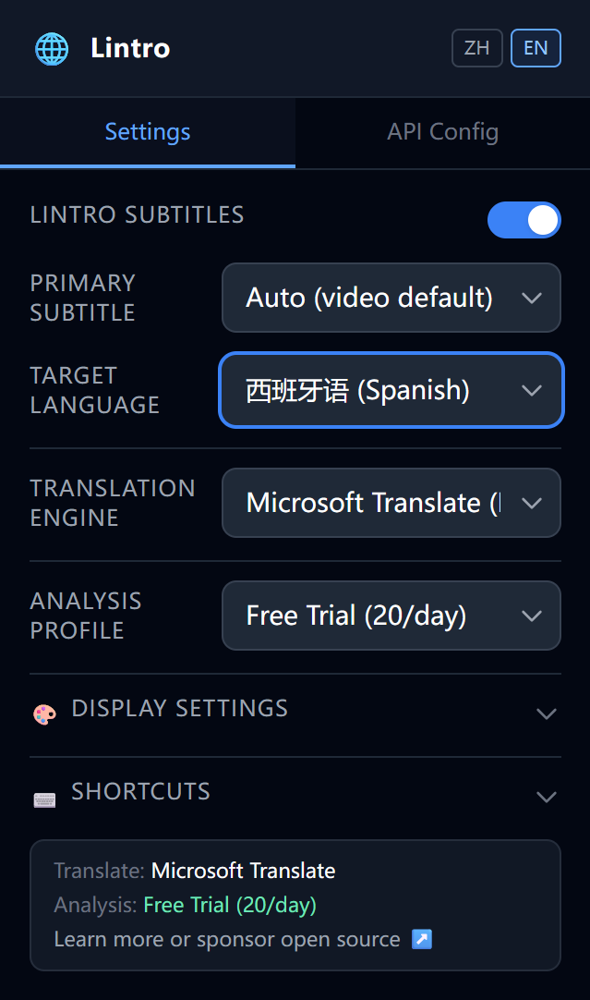

<p align="center">
  
</p>

<h1 align="center">Lintro - AI Language Learning for Video Subtitles</h1>

<p align="center">
  <a href="./README.md">中文</a> | English
</p>

<p align="center">
  <strong>YouTube & Bilibili bilingual subtitle overlay + AI grammar analysis for language learning</strong>
</p>

<p align="center">
  <a href="https://chromewebstore.google.com/detail/lintro/bhmidhindpnbnalkphdlbiclkioiegol?hl=en">Get it on Chrome Web Store</a> |
  <a href="https://microsoftedge.microsoft.com/addons/detail/lintro/jcfcpdonbccbnlpjhbkebhnapggikkkb">Get it on Edge Add-ons</a>
</p>

<p align="center">
  <a href="#features">Features</a> •
  <a href="#installation">Installation</a> •
  <a href="#quick-start">Quick Start</a> •
  <a href="#development">Development</a> •
  <a href="#tech-stack">Tech Stack</a> •
  <a href="#license">License</a>
</p>

---

## UI Preview

<p align="center">
  
</p>

<p align="center">
  
</p>

<p align="center">
  
</p>

## Features

### 🎬 Bilingual Subtitle Overlay
- Real-time translated subtitles on both **YouTube** and **Bilibili** players.
- Three translation engines: **Google Translate**, **Microsoft Translate**, and **LLM translation**.
- Sliding-window pretranslation for smooth subtitle playback.
- Sentence chunking optimized for CJK and Latin text to avoid awkward long lines.
- Auto-detects ad segments and skips translation.

### 🧠 AI Grammar Analysis
- Click any subtitle sentence or use a hotkey to trigger AI grammar analysis.
- Two-stage analysis flow for faster perceived response.

### ⚙️ Multiple API Profiles
- Store multiple API profiles and use different models for translation and analysis.
- One-click API connectivity test for API key / endpoint / model.
- Built-in provider presets: **OpenAI / DeepSeek / Zhipu GLM / SiliconFlow** and any OpenAI-compatible endpoint.
- Non-reasoning models are recommended for lower latency.

### 🎨 Display Customization
- Independent font-size controls for subtitle and analysis panel.
- Subtitle position: top or bottom (auto avoids player controls).
- Subtitle background style: none / translucent / solid.
- Fully configurable original/translation colors.
- Switch display order between original-first and translation-first.
- **Cover mode**: hide translation until click/hotkey reveal (great for self-testing).
- Analysis panel opacity slider.

### ⌨️ Shortcuts
- **Trigger AI analysis** - default `Alt+A`
- **Replay current line** - default `Alt+R`
- **Reveal covered translation** - default `Alt+S`
- All key combos are customizable in settings.

### 🌐 Language Support
- 18 supported target languages.
- Primary subtitle language can be auto-detected or manually selected.
- Settings are saved automatically.

## Installation

### Chrome / Edge - Load as unpacked extension

1. Clone the repo and install dependencies:
   ```bash
   git clone https://github.com/p1aymaker9/lintro.git
   cd lintro
   pnpm install
   ```

2. Build:
   ```bash
   # Chrome
   pnpm build

   # Edge
   pnpm build:edge
   ```

3. Load in browser:
- Open `chrome://extensions` (or `edge://extensions`)
- Enable **Developer mode**
- Click **Load unpacked**
- Select `.output/chrome-mv3/` (or `.output/edge-mv3/`)

## Quick Start

1. Install the extension and click the Lintro icon in your browser toolbar.
2. Open **API Config** and fill in API Key, Endpoint, and Model. Click **Test Connection**.
3. Go back to **Settings**:
- Pick a translation engine (Google/Microsoft are free; LLM requires API setup)
- Select a profile for AI analysis
- Choose target language
- Expand **Display Settings** and **Shortcuts** as needed
4. Open any YouTube or Bilibili video; bilingual subtitles will render automatically.
5. Click a subtitle sentence or press `Alt+A` to open AI grammar analysis.

## Development

### Requirements
- Node.js >= 18
- pnpm >= 8

### Permissions

- The extension needs access to YouTube/Bilibili pages and translation/LLM APIs.
- To support custom/proxy endpoints, `host_permissions` includes `https://*/*` by default.
- If you only use fixed providers, narrow it in [wxt.config.ts](wxt.config.ts), then rebuild.

### Common Commands

```bash
# install deps
pnpm install

# dev mode (hot reload)
pnpm dev

# build Chrome
pnpm build

# build Edge
pnpm build:edge

# pack zip (for web store upload)
pnpm zip

# TypeScript check
pnpm compile
```

### Project Structure

```
├── entrypoints/
│   ├── background.ts          # Background Service Worker (message routing & API proxy)
│   ├── extractor.ts           # Main-world script (intercept XHR/fetch subtitle payloads)
│   ├── youtube.content.tsx    # YouTube subtitle overlay & translation pipeline
│   ├── bilibili.content.tsx   # Bilibili subtitle overlay & translation pipeline
│   ├── popup/                 # Extension popup (React)
│   │   ├── App.tsx            # Settings + API Config tabs
│   │   └── ...
│   ├── components/
│   │   ├── SubtitleOverlay.tsx # Shadow DOM subtitle overlay component
│   │   └── AnalysisPopover.tsx # AI grammar analysis popover
│   └── lib/
│       ├── storage.ts         # Profile storage and migration
│       ├── llm-api.ts         # LLM API layer and prompt engineering
│       ├── google-translate.ts    # Google Translate (gtx) free path
│       ├── microsoft-translate.ts # Microsoft Translate (Edge auth) free path
│       ├── sentence-chunker.ts    # Sentence chunking logic
│       ├── sliding-window-translator.ts # Sliding-window LLM pretranslation
│       ├── subtitle-normalizer.ts # Subtitle normalization for YouTube/Bilibili
│       └── constants.ts       # Language list and constants
├── pic/                       # README screenshots
├── public/icon/               # Extension icons
├── wxt.config.ts              # WXT config & Manifest V3
├── tailwind.config.js         # Tailwind config
└── package.json
```

## Tech Stack

| Technology | Purpose |
|------|------|
| [WXT](https://wxt.dev) v0.20 | Browser extension framework |
| Manifest V3 | Chrome / Edge extension standard |
| React 19 | Popup UI & Shadow DOM components |
| Tailwind CSS v3 | Styling |
| TypeScript 5 | Type safety |
| Vite 7 | Build tooling |

## License

Licensed under GNU Affero General Public License v3.0 (AGPL-3.0-only).

See [LICENSE](LICENSE) for details.
