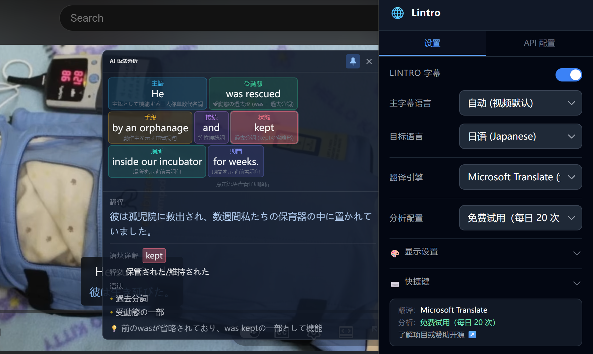

<p align="center">
  
</p>

<h1 align="center">Lintro - 双语字幕与 AI 语法分析</h1>

<p align="center">
   中文 | <a href="./README.en.md">English</a>
</p>

<p align="center">
  <strong>YouTube & Bilibili 双语字幕叠加 + AI 语法分析 — 看视频学语言</strong>
</p>

<p align="center">
   <a href="https://chromewebstore.google.com/detail/lintro/bhmidhindpnbnalkphdlbiclkioiegol?hl=zh">在 Chrome 应用商店获取</a> |
   <a href="https://microsoftedge.microsoft.com/addons/detail/lintro/jcfcpdonbccbnlpjhbkebhnapggikkkb">在 Edge 插件商店获取</a>
</p>

<p align="center">
  <a href="#功能特性">功能</a> •
  <a href="#安装方式">安装</a> •
  <a href="#快速上手">快速上手</a> •
  <a href="#开发指南">开发</a> •
  <a href="#技术栈">技术栈</a> •
  <a href="#许可证">许可证</a>
</p>

---

## 功能特性

## 界面预览


<p align="center">
   
</p>

<p align="center">
   
</p>


### 🎬 双语字幕叠加
- 在 **YouTube** 和 **Bilibili** 视频播放器内实时叠加翻译字幕
- 三种翻译引擎：**Google Translate**、**Microsoft Translate**、**LLM 大模型翻译**
- 滑动窗口预翻译，字幕切换无延迟
- 智能句块聚合算法，CJK ↔ 英文翻译精确断句，避免过长译文
- 自动检测广告片段并跳过翻译


### 🧠 AI 语法分析
- 点击任意字幕句子或使用快捷键，触发 AI 语法解析

### ⚙️ 多 API 配置管理
- 多组 API Profile：可保存多套 API 凭据，翻译与分析可使用不同模型
- 一键测试连接：验证 API Key / Endpoint / Model 是否可用
- 预设供应商：**OpenAI / DeepSeek / 智谱 GLM / 硅基流动 (SiliconFlow)** 及任何 OpenAI 兼容接口
- 推荐使用非推理模型，响应速度更快

### 🎨 显示自定义
- 字幕字体大小 / 分析窗口字体大小独立调节
- 字幕位置：顶部或底部（自动避让播放器控制栏）
- 字幕背景样式：无 / 半透明 / 实色
- 原文 / 译文颜色自由配置
- 原文 / 译文显示顺序切换
- **遮盖模式**：隐藏译文，点击或快捷键才显示，适合自测练习
- 分析弹窗透明度滑块

### ⌨️ 快捷键
- **触发 AI 分析** — 默认 `Alt+A`
- **重播当前句** — 默认 `Alt+R`
- **显示遮盖译文** — 默认 `Alt+S`
- 可在设置面板中自定义组合键

### 🌐 多语言支持
- 翻译目标语言支持 18 种语言
- 主字幕语言手动选择或自动检测
- 设置项自动保存，无需手动提交

## 本地安装方式（建议从应用商店获取）

### Chrome / Edge — 开发者模式加载

1. 克隆仓库并安装依赖：
   ```bash
   git clone https://github.com/p1aymaker9/lintro.git
   cd lintro
   pnpm install
   ```

2. 构建：
   ```bash
   # Chrome
   pnpm build

   # Edge
   pnpm build:edge
   ```

3. 在浏览器中加载：
   - 打开 `chrome://extensions`（或 `edge://extensions`）
   - 开启 **开发者模式**
   - 点击 **加载已解压的扩展程序**
   - 选择 `.output/chrome-mv3/`（或 `.output/edge-mv3/`）目录

## 快速上手

1. **安装扩展** 后，点击浏览器工具栏中的 Lintro 图标
2. 切换到 **「API 配置」** 标签页，填写你的 API Key、Endpoint、Model，点击 **🔌 测试连接** 确保可用
3. 回到 **「设置」** 标签页：
   - 选择翻译引擎（Google / Microsoft 免费可用；LLM 需要 API 配置）
   - 选择 AI 分析引擎使用的 API 配置
   - 选择翻译目标语言
   - 展开「显示设置」自定义字幕样式
   - 展开「快捷键」配置常用操作
4. 打开 YouTube 或 Bilibili 视频，双语字幕将自动叠加在播放器中
5. **点击任意字幕句子** 或按 `Alt+A` 弹出 AI 语法分析窗口

## 开发指南

### 环境要求
- Node.js ≥ 18
- pnpm ≥ 8

### 权限说明

- 本扩展需要访问 YouTube/Bilibili 页面以及翻译/LLM 接口。
- 为了支持「自定义 / 第三方中转」Endpoint，默认 `host_permissions` 包含 `https://*/*`。
   - 若你只使用固定域名的供应商，可在 [wxt.config.ts](wxt.config.ts) 中收窄 `host_permissions`，然后重新构建再加载。

### 常用命令

```bash
# 安装依赖
pnpm install

# 开发模式（热重载）
pnpm dev

# 构建 Chrome 生产包
pnpm build

# 构建 Edge 生产包
pnpm build:edge

# 打包 zip（可直接上传 Chrome Web Store）
pnpm zip

# TypeScript 类型检查
pnpm compile
```

### 项目结构

```
├── entrypoints/
│   ├── background.ts          # Background Service Worker — 消息路由 & API 代理
│   ├── extractor.ts           # Main World 脚本 — XHR/fetch 拦截字幕数据
│   ├── youtube.content.tsx    # YouTube 字幕叠加 & 翻译逻辑
│   ├── bilibili.content.tsx   # Bilibili 字幕叠加 & 翻译逻辑
│   ├── popup/                 # 扩展 Popup（React）
│   │   ├── App.tsx            # 双 Tab 布局 — 设置 + API 配置
│   │   └── ...
│   ├── components/
│   │   ├── SubtitleOverlay.tsx # Shadow DOM 字幕叠加组件（可配置样式）
│   │   └── AnalysisPopover.tsx # AI 语法分析弹窗（两段式加载）
│   └── lib/
│       ├── storage.ts         # 多 Profile 配置存储 & 迁移
│       ├── llm-api.ts         # LLM API 调用层 & Prompt 工程
│       ├── google-translate.ts    # Google Translate (gtx) 免费翻译
│       ├── microsoft-translate.ts # Microsoft Translate (Edge auth) 免费翻译
│       ├── sentence-chunker.ts    # 句块聚合算法（CJK 优化）
│       ├── sliding-window-translator.ts # LLM 滑动窗口预翻译
│       ├── subtitle-normalizer.ts # 字幕归一化（YouTube JSON3/XML + Bilibili）
│       └── constants.ts       # 支持的语言列表等常量
├── public/icon/               # 扩展图标
├── wxt.config.ts              # WXT 框架配置 & Manifest V3
├── tailwind.config.js         # Tailwind CSS 配置
└── package.json
```

## 技术栈

| 技术 | 用途 |
|------|------|
| [WXT](https://wxt.dev) v0.20 | 浏览器扩展开发框架 |
| Manifest V3 | Chrome / Edge 扩展标准 |
| React 19 | Popup UI & Shadow DOM 组件 |
| Tailwind CSS v3 | 组件样式 |
| TypeScript 5 | 类型安全 |
| Vite 7 | 构建工具 |

## 架构概览

```
┌──────────────┐     ┌──────────────────┐     ┌──────────────────┐
│  Main World  │────▶│  Content Script  │────▶│   Background SW  │
│  extractor   │     │  YouTube/Bilibili│     │  API Proxy       │
│  XHR/fetch   │     │  Shadow DOM UI   │     │  LLM calls       │
│  拦截字幕    │     │  字幕叠加 & 分析  │     │  Google/MS 翻译  │
└──────────────┘     └──────────────────┘     └──────────────────┘
                              ▲
                              │ Popup
                     ┌────────┴────────┐
                     │   设置 Tab       │
                     │   API 配置 Tab   │
                     └─────────────────┘
```

## 许可证

本项目采用 GNU Affero General Public License v3.0（AGPL-3.0-only）开源。

详见 [LICENSE](LICENSE)。
